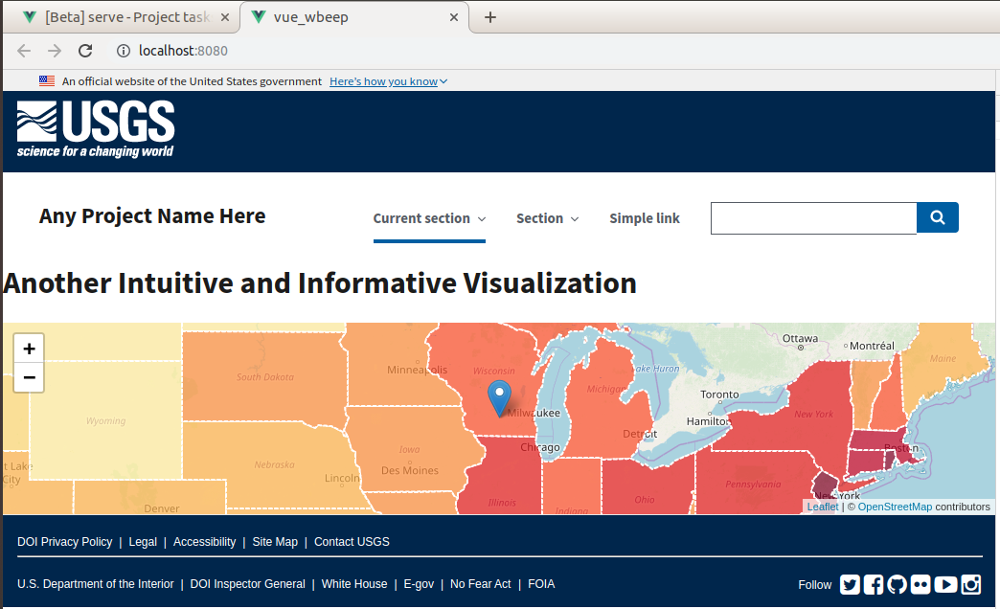

# Testing area for WBEEP 
This project is intended to be a model for the Water Budget Estimation and Evaluation Project (WBEEP).
With the information provided, you can build a website using the Vue framework that incorporates Leaflet maps using the Vue2Leaflet plugin to provide Vue style components for the map layers. 

Image 1: Example of Final Product 


### Background
This project builds on the project 'makerspace-website-base' ( https://github.com/usgs-makerspace/makerspace-website-base ), which provides useful information on creating projects using the Vue framework. Expanding on what was created in 'makerspace-website-base', this project adds a Leaflet map with Vue-like component map layers using the Vue2Leaflet plugin. The Leaflet documentation offers an 'Interactive Choropleth Map' example that seemed like a good model for what is needed in WBEEP. The example creates a Leaflet map layer that takes in geojson and produces the outlines of US states. This layer is then overlaid on a set of map tiles. In the Leaflet example, Mapbox tiles are used. In this project OpenStreetMap tiles are used. Mapbox required a registration key, while OpenStreetmap did not. So to avoid adding additional complications, OpenStreetMap was used. 

#### IDEAS!
It seems that the Leaflet Choropleth example provides much of the what is needed in WBEEP. I believe that we can use a geojson layer showing states boundaries as the initial layer. The example has a 'click to zoom feature' that would be ideal for users to use to zone in on the region they want to explore. After the zoom, we could allow a second layer of geojson with the Hydrological Response unit (HRU) boundaries that could also be clickable to zoom into the data for each HRU. Perhaps, we could also add an intermediate layer that would allow clicking down to a county level . . . (One caveat, I did not have time to get the click-to-zoom working, but I mostly understand the pattern now, and I think it is very possible) 

## Get Started - Create Your Project
##### Create Your Project - option 1 - clone or download the complete project
This is the fastest way, and if you already have a background in Vue, go ahead fork the repo and clone/download away.

##### Create Your Project - option 2 -The Step by Step from the Beginning
If you are not familiar with the Vue framework and have not completed the first 'step-by-step' section of this project ( https://github.com/usgs-makerspace/makerspace-website-base ), you may find value in checking that out.

##### Create Your Project -option 3 - Download the Base Project and then Add Leaflet 
This is the best option if you want to learn about using Leaflet with Vue, are familiar with Vue or have gone through the 'step-by-step' tutorial ( https://github.com/usgs-makerspace/makerspace-website-base ), and want to know more about how the Vue2Leaflet plugin fits into the picture. The remainder of this readme deals with this option.

### Get the base project
The base project is at https://github.com/usgs-makerspace/makerspace-website-base . On the repository home page, hit green 'Clone or download' button and then select 'Download ZIP'. Extract the ZIPed files to a directory of your choice and change root directory of 'makerspace-base-wbeep'. Once there, run 'npm install' to pull down the project dependencies. Then, run the project according to the 'Running the Project' instruction in the repository.

### Install Leaflet and Vue2Leaflet in to the project
Once the base project up and running you can move on getting a Leaflet map running. Leaflet is an open-source mapping library for displaying data on maps. We will also add a Vue plugin called Vue2Leaflet which allows Leaflet map layers to work within the Vue framework as a set of Vue components. 

General Leaflet information: https://leafletjs.com/

Valuable Leaflet code example demonstrating . . .

    creation of interactive geojson layer: https://leafletjs.com/examples/choropleth/

General Vue2Leaflet information: https://www.npmjs.com/package/vue2-leaflet  

Valuable Vue2Leaflet code examples that demonstrate . . .

    multiple geojson layers: https://github.com/KoRiGaN/Vue2Leaflet/blob/master/examples/src/components/GeoJSON2.vue

    layer styling and map markers: https://github.com/KoRiGaN/Vue2Leaflet/blob/master/examples/src/components/GeoJSON.vue


Use Node Package Manager (NPM) to install Leaflet and Vue2Leaflet. You can install them both in a single command.
```
npm install vue2-leaflet leaflet --save
```
You may get a warning reguarding a peer dependency for Vue2Leaflet
```
vue2-leaflet@2.1.1 requires a peer of @types/leaflet@^1.2.11 but none is installed. You must install peer dependencies yourself.

```
I am not sure if it is necessary, but it does not seem to hurt to install the peer dependency. 
```
npm install @types/leaflet@^1.2.11
```
Your 'package.json' file should now look something like . . .
```
{
  "name": "vue_wbeep",
  "version": "0.1.0",
  "private": true,
  "scripts": {
    "serve": "vue-cli-service serve",
    "build": "vue-cli-service build",
    "lint": "vue-cli-service lint"
  },
  "dependencies": {
    "@types/leaflet": "^1.4.4",
    "core-js": "^2.6.5",
    "leaflet": "^1.5.1",
    "uswds": "^2.0.2",
    "vue": "^2.6.10",
    "vue2-leaflet": "^2.1.1"
  },
  "devDependencies": {
    "@vue/cli-plugin-babel": "^3.8.0",
    "@vue/cli-plugin-eslint": "^3.8.0",
    "@vue/cli-service": "^3.8.0",
    "babel-eslint": "^10.0.1",
    "eslint": "^5.16.0",
    "eslint-plugin-vue": "^5.0.0",
    "node-sass": "^4.9.0",
    "sass-loader": "^7.1.0",
    "vue-template-compiler": "^2.6.10"
  }
}
```
Give your project a test run using Vue UI or the Vue CLI development server.
```
vue ui      // starts the Graphic User Interface you can use to run the project
npm run serve  // starts the Vue CLI server 
```
At this point, Vue UI it will occasionally throw a compiling error related to node-sass bindings. If you get an error, check the console output for the solution on how to fix the bindings.

### Add the Leaflet Map
Since the Vue framework keeps all of our page parts (header, footer, content, etc.) compartmentalized as components, we once the needed dependencies are installed we will only have to worry about code that exist in the component we want to change. In this case, that component will be 'Visualization.vue'

This project is based on a combination of three examples gathered from Leaflet and Vue2Leaflet documentation (see above for the links). The main example used is https://leafletjs.com/examples/choropleth/ . This example is specific to Leaflet and the purpose of this project is to adapt the example for use with Vue. To make this process a bit more Vue-like, we will use the Vue2Leaflet plugin.

#### Import the Leaflet and Vue2Leaflet Modules
In the NPM Install step we asked NPM to pull the modules down from the NPM repository, now we need to tell Vue where in our project they should be used. This will be done the 'script' element of 'Visualization.vue' (the visualization component).
```
<script>
    import L from 'leaflet';  // ADDED - import the 'L' export of the 'leaflet' module
    import { LMap, LTileLayer, LMarker, LGeoJson } from 'vue2-leaflet'; // ADDED  
    
    export default {
        name: 'Visualization',
        props: {
            msg: String
        }
    }
</script>
```
If you save now, the development server will show several 'unused import errors'. These are 'linting' errors (code cleaning) errors that will not stop the project from running. We will take care of them in a bit.

According the Leaflet example to add the map to our page, we should do this  . . . 
```
var mapboxAccessToken = {your access token here};
var map = L.map('map').setView([37.8, -96], 4);

L.tileLayer('https://api.tiles.mapbox.com/v4/{id}/{z}/{x}/{y}.png?access_token=' + mapboxAccessToken, {
    id: 'mapbox.light',
    attribution: ...
}).addTo(map);

L.geoJson(statesData).addTo(map);
```
This will not work without a little tweaking.

To start we need to give our map a place to go on the page. In regular, Leaflet this would be done with a 'div' element with id of 'map' or something similar, but the Vue2Leaflet will give us a better option.
```
<div id='map'></div> // the regular Leaflet way

<l-map ref="map"><l-map> // the Vue2Leaflet way
```
Vue2Leaflet allows us to 'component-ize' our layers. The 'l-map' element is actually a Vue component. 
Add the 'l-map' element (component) to the 'template' element.

```
<template>
    <div id="visualization">
        
        <h1>{{ msg }}</h1>
        <l-map ref="map"></l-map> // added this element
    </div>
</template>
```

As a note, I could not find any comprehensive Vue2Leaflet documentation, so most of the what is covered here was discovered experimentally.

Anyway, back to the 'l-map' component. Just as was mentioned in the previous tutorial for 'makerspace-website-base', in order for Vue to use a component, it has to be registered. This is done in the 'export' section of the 'script' tag.

```
<script>
    import L from 'leaflet';
    import { LMap, LTileLayer, LMarker, LGeoJson } from 'vue2-leaflet';

    export default {
        name: 'Visualization',
        props: {
            msg: String
        },            // don't forget the comma  
        components: { // registered the LMap component
            LMap      // registered the LMap component
        }             // don't forget the closing brace  
    }
</script>
```
For Vue to use a component, three things are needed: 1) an import, 2) registration as a component, 3) an element added to the template.

Once the component is added, you will notice that we have one less 'unused import error' on the development server output. However, the 'l-map' component will not show on the server's web page, because it has no content. To give it content we will apply some 'attributes' to the 'l-map' element tag.

This is a Vue2Leaflet thing. We imported the Vue2Leaflet export 'LMap' and 'LMap' has special 'component' abilities. 'LMap' allows us to use the 'l-map' tag and to apply attributes to that tag that Leaflet would normally accept as variables.

Looking back at the Leaflet code from the choropleth example posted earlier, you will see the use of a couple 'var' statements.
```
var mapboxAccessToken = {your access token here};
var map = L.map('map').setView([37.8, -96], 4);
```
We can ignore the first one because we are going to use map tiles from OpenStreetMap and bypass the need for an access token. The second 'var' statement uses a Leaflet function 'L.map' to set the latitude and longitude of the center of the map when it is loaded onto the page. The remaining number is the view magnification. 

To set make this work using Vue2Leaflet we are going to rely on the magic of 'LMap' and specify these values in the 'l-map' element.
```
        <l-map ref="map"
               :zoom="zoom"                 //added
               :center="center"             //added
               style="height: 200px;">      //added   
        </l-map>
```
So ':zoom' and ':center' are Vue data bindings, no need to get deeply into that at the moment but just understand that they tell Vue to look in the 'data' section of the 'script' element to find the values. We could also just hard code the values here as I did with the 'style' (notice the lack of a colon).

Because we told Vue to look in the 'data' section of 'style' we need to put some values there or we will get an error.
```
<script>
    import L from 'leaflet';
    import { LMap, LTileLayer, LMarker, LGeoJson } from 'vue2-leaflet';
   
    export default {
        name: 'Visualization',
        props: {
            msg: String
        },
        components: {
            LMap
        },
        data () {                                        // added a data function to the export--this is a Vue data binding
            return {                                     // function will return Leaflet map parameters 
                zoom: 5,                                 // a 'zoom' parameter
                center: L.latLng(43.092641, -89.532142)  // the view center point              
                }
            }
        }
    }
</script>
```
Okay, now we have added the data Vue will look because of the ':' data binding, which is also the variable data that 'LMap' needed to set up for Leaflet.

So now that you have 'LMap' as a model, you can probably figure out what else is needed to get the map up and running. 

We will have to register the remaining components that we imported from 'vue2-leaflet'. Like so . . .
```
    export default {
        name: 'Visualization',
        props: {
            msg: String
        },
        components: {
            LMap,
            LTileLayer,  // add the Vue2Leaflet components
            LMarker      // add the Vue2Leaflet components            
        },
        data () {
            return {
                loading: false,
                zoom: 5,
                center: L.latLng(43.092641, -89.532142)
            }
        }
    }
</script>
```
Well, we did not register all the components; we will get to the LGeoJson in a bit.

Okay let us get this map going. To make the map look like a map, we will need a map--duh. We will get the map we need in the form of 'tiles' that have been assembled for us by OpenStreetMaps. You can get more information on the 'tiles' topic by reading the Leaflet tutorial. For now, just accept that using the code will make a web call to OpenStreetMaps and grab the map image as a tile.

In regular Leaflet, that command looks like (from the tutorial, which uses an access token)
```
L.tileLayer('https://api.tiles.mapbox.com/v4/{id}/{z}/{x}/{y}.png?access_token=' + mapboxAccessToken, {
    id: 'mapbox.light',
    attribution: ...
}).addTo(map);
```
With Vue2Leaf we will add a 'l-tile-layer' element in the 'template' element (remember, we are using OpenStreetMap, so the variables needed are just a smidgen different than above).
```
<template>
    <div id="visualization">
        <h1>{{ msg }}</h1>
        <l-map ref="map"
               :zoom="zoom"
               :center="center"
               style="height: 200px;">
            <l-tile-layer :url="url"                                 // added
                          :attribution="attribution"></l-tile-layer> //
        </l-map>
    </div>
</template>
```
As you may of surmised, since we have the ':' we have Vue data binding, so we need to add the actual values in that section.
```
script>
    import L from 'leaflet';
    import { LMap, LTileLayer, LMarker, LGeoJson } from 'vue2-leaflet';
    import data from '../assets/geojson/us-states';
   
    export default {
        name: 'Visualization',
        props: {
            msg: String
        },
        components: {
            LMap,
            LTileLayer,
            LMarker
        },
        data () {
            return {                
                zoom: 5,
                center: L.latLng(43.092641, -89.532142),
                url: 'http://{s}.tile.osm.org/{z}/{x}/{y}.png',    //added
                attribution: '&copy; <a href="http://osm.org/copyright">OpenStreetMap</a> contributors'  //added
            }
        }
    }
</script>
```
Now, if we add just one more thing, we should see a map. We need to import the Leaflet CSS from its node module. We will do this inside the 'style' element.
```
 <style scoped lang="scss">
     @import "~leaflet/dist/leaflet.css";
 </style>
```
 Hopefully, you now have a map.
 
 #### add a marker
 To add a marker we have to add a bit of code, that frankly, I do not understand, but it is standard implementation from the Vue2Leaflet documentation, so we will go with it.
 Add this to the 'script' element after the imports. This code styles the map markers.
 ```
     delete L.Icon.Default.prototype._getIconUrl;
     L.Icon.Default.mergeOptions({
         iconRetinaUrl: require('leaflet/dist/images/marker-icon-2x.png'),
         iconUrl: require('leaflet/dist/images/marker-icon.png'),
         shadowUrl: require('leaflet/dist/images/marker-shadow.png')
     });
```
 Then we can use 'LMarker' to create a map layer just as we did with 'LTileLayer'.
 First add the 'l-marker' element in the 'template' element.
 ```
 <template>
     <div id="visualization">
         <h1>{{ msg }}</h1>
         <l-map ref="map"
                :zoom="zoom"
                :center="center"
                style="height: 200px;">
             <l-tile-layer :url="url"
                           :attribution="attribution"></l-tile-layer>
             <l-marker :lat-lng="marker"></l-marker>                   // added
         </l-map>
     </div>
 </template>
```
Then complete the data binding.
```
data () {
            return {
                loading: false,
                zoom: 5,
                center: L.latLng(43.092641, -89.532142),
                url: 'http://{s}.tile.osm.org/{z}/{x}/{y}.png',
                attribution: '&copy; <a href="http://osm.org/copyright">OpenStreetMap</a> contributors',
                marker: L.latLng(43.092641, -89.532142)   // added
            }
```

So now we have a map with one marker. Let us add some GeoJson to show state boundaries. 

#### Get Some GeoJson
GeoJson is a regular JSON object with geo-spacial features attached. If you want to learn more about GeoJson checkout out https://macwright.org/2015/03/23/geojson-second-bite.html but, for now let us consider it good enough if we know how to add it to our project. Things like data objects and images are conventionally stored in the 'assets' folder. So, let us make a new directory in the assets folder called 'geojson'. Once that is done, we can make file called 'us-states.js'. We will populate that with some sample data from the Leaflet choropleth example. You can go there and get it, or you can just grab it out of this repository.

If you looked at GeoJson, you may have noticed that encapsulated in a 'export' statement. This means that it will act as an ES6 module and we will be able to grab the data from the module anywhere in our project provided we import the module first.

```
import data from '../assets/geojson/us-states';
``` 
Adding the above statement to our 'script' element with the other import statements will allow us free use of the GeoJson in our 'visualization' component. Basically, the import is telling Vue to grab the JSON object with the primary key (the first key of the JSON object) of 'statesData', from the assets/geojson folder, and name it 'data'. This is important, because in order to access the data stored in the JSON we will have to know both the name we imported the object as (we used 'data', but it could be 'states' or 'fish' or anything else) and the primary key.

Knowing this we will be able to add our 'state data' to the data that Vue can use.
```
  data () {
            return {
                loading: false,
                zoom: 5,
                center: L.latLng(43.092641, -89.532142),
                url: 'http://{s}.tile.osm.org/{z}/{x}/{y}.png',
                attribution: '&copy; <a href="http://osm.org/copyright">OpenStreetMap</a> contributors',
                marker: L.latLng(43.092641, -89.532142),
                statesData: {
                    geojson: data.statesData // added 
                }
            }
        }    
```
With the data added we have done one of three parts needed to make a Vue component work. Let us finish the job by registering the component.
```
    export default {
        name: 'Visualization',
        props: {
            msg: String
        },
        components: {
            LMap,
            LTileLayer,
            LMarker,
            LGeoJson  // added
        },
```
 Then make the element.
 ```
 <template>
     <div id="visualization">
         <h1>{{ msg }}</h1>
         <l-map ref="map"
                :zoom="zoom"
                :center="center"
                style="height: 200px;">
             <l-tile-layer :url="url"
                           :attribution="attribution"></l-tile-layer>
             <l-geo-json :geojson="statesData.geojson"                  // added
                         :options="statesData.options"></l-geo-json>    // added
             <l-marker :lat-lng="marker"></l-marker>
         </l-map>
     </div>
 </template>
```
Notice how I added an extra binding called 'options'. This is because the Leaflet function that creates GeoJson layer has several optional parameters. One of these allows us to override the default color and style.
To make this work we have to bind the data for the options.
```
        data () {
            return {
                loading: false,
                zoom: 5,
                center: L.latLng(43.092641, -89.532142),
                url: 'http://{s}.tile.osm.org/{z}/{x}/{y}.png',
                attribution: '&copy; <a href="http://osm.org/copyright">OpenStreetMap</a> contributors',
                marker: L.latLng(43.092641, -89.532142),
                statesData: {
                    geojson: data.statesData,
                    options: {                             // added
                        style: function(feature) {         // added
                            return styleFunction(feature)  // added
                        }                                  // added
                    }                                      // added
                }
            }
        }
```
From there there are a couple of functions that we need to process the styles, but I am out of time for now . . .
Hopefully this is a good starting point, until I have time to add the rest.  

# Generalized Setup Information

## Project setup
Once the project is cloned locally, use Node Package Manager (NPM) to download and install all the needed project dependencies.
```
npm install
```

### Compiles and hot-reloads for development
To start a local server and run the project from the command line, use the  HTTP server built into Vue-cli with the following command. This will start a server and open a browser window.
```
npm run serve
```

### Compiles and minifies for production
To package the project for deployment use the following command. This will produce a 'dist' directory containing all the files required to run the project. Note that the project requires an HTTP server to view locally from the 'dist' folder.
```
npm run build
```
The dist directory is meant to be served by an HTTP server (unless you've configured publicPath to be a relative value), so it will not work if you open dist/index.html directly over file:// protocol. The easiest way to preview your production build locally is using a Node.js static file server. First, install server NPM package globally, Then run the project as follows.
```
npm install -g serve
# -s flag means serve it in Single-Page Application mode
# which deals with the routing problem below
serve -s dist
```
If you are using Vue Router in history mode, a simple static file server will fail. For example, if you used Vue Router with a route for /todos/42, the dev server has been configured to respond to localhost:3000/todos/42 properly, but a simple static server serving a production build will respond with a 404 instead.

To fix that, you will need to configure your production server to fallback to index.html for any requests that do not match a static file. The Vue Router docs provides configuration instructions for common server setups

### Run your tests
If you configured the project for tests, and have included them, they can be run with the following.
```
npm run test
```

### Lints and fixes files
```
npm run lint
```

### Customize configuration
See [Configuration Reference](https://cli.vuejs.org/config/).
